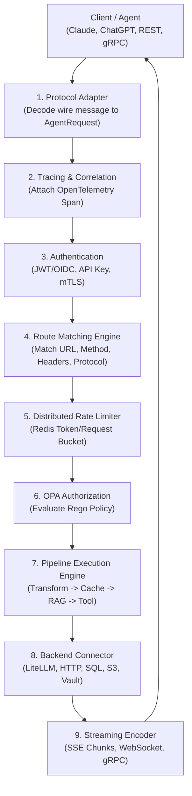

# Torana — Embeddable Enterprise AI Gateway

> **तोरण** *(Sanskrit: "gateway arch")* — A high-performance, reactive enterprise gateway for AI agents, Model Context Protocol (MCP), and LLM infrastructure.

[](https://openjdk.org/projects/jdk/17/)
[](https://spring.io/projects/spring-boot)
[](https://projectreactor.io/)
[](LICENSE)

---

## What is Torana?

Torana is a **stateless, reactive enterprise gateway** purpose-built for AI agents and LLM application infrastructure. It provides a unified, declarative control plane that bridges external AI protocols with internal enterprise systems.

### Core Capabilities:
- **Universal Protocol Gateway:** Expose and consume services over **MCP (Model Context Protocol)**, **HTTP/REST**, **WebSocket**, and **gRPC**.
- **MCP-to-REST Bridge:** Expose internal legacy microservices and databases as secure MCP tools to Claude, ChatGPT, and Gemini with zero code changes.
- **Zero-Trust Security:** JWT/OIDC authentication, dynamic **HashiCorp Vault** credential brokering, and fine-grained **Open Policy Agent (OPA)** Rego authorization.
- **Reactive AI Pipelines:** Declarative, non-blocking step chains for prompt transformation, vector RAG injection, Redis response caching, and prompt moderation.
- **Enterprise Resilience:** Distributed sliding-window rate limiting (Redis), circuit breakers (Resilience4j), timeouts, and automated model fallback cascades.
- **Compliance & Auditing:** Real-time SHA-256 hashed audit events with zero PII retention, compatible with OpenTelemetry semantic conventions.

---

## How Torana Works

Torana processes every inbound request through an asynchronous, non-blocking reactive chain powered by **Spring WebFlux** and **Project Reactor**.

### Request Lifecycle Architecture



### The 5 Architectural Pillars:

1. **Protocol Normalization (`torana-core`):** Inbound wire protocols are translated into an immutable, protocol-agnostic `AgentRequest`.
2. **Context Propagation (`AgentContext`):** An immutable reactive state container carries security tokens, tenant IDs, tracing context, and matched routes through all filters.
3. **Declarative Route Matcher (`torana-routing`):** Routes are matched in priority order (Exact match > Longest prefix > Wildcards) with zero-allocation read-path evaluation and runtime hot-reloading.
4. **Step-Chain Pipeline (`torana-pipeline`):** Composable middleware steps execute sequentially with support for short-circuiting (e.g. cache hits) and automated fallback pipelines (`on-error`).
5. **Pluggable Connectors (`torana-connector-*`):** SPI-driven outbound adapters communicate with LLMs (LiteLLM/OpenAI), internal REST APIs, SQL databases (R2DBC), and cloud storage (S3/NFS).

---

## Quick Start Guide

### 1. Prerequisites
- **Java 17+** (JDK)
- **Docker & Docker Compose** (for Redis and OPA services)

### 2. Start Infrastructure Dependencies
Start the local Redis and Open Policy Agent (OPA) containers:
```bash
docker compose -f torana-deployment/docker-compose/docker-compose.yml up -d redis opa
```

### 3. Run the Torana Gateway
```bash
./gradlew :torana-starter:bootRun
```
The gateway will start on **`http://localhost:8080`**.

Verify gateway health:
```bash
curl http://localhost:8080/actuator/health
```

---

## Configuration Guide (`application.yaml`)

Torana is configured entirely through declarative YAML. Routes, security rules, pipelines, and backends can be updated dynamically at runtime without restarting the server.

### Complete Example Configuration

```yaml
torana:
  # ─── Protocols ─────────────────────────────────────────────────────────────
  protocols:
    mcp:
      enabled: true
      path: /mcp/v1
    rest:
      enabled: true
      path: /api/v1/**
    websocket:
      enabled: true
      path: /ws/**

  # ─── Security & Authentication ─────────────────────────────────────────────
  security:
    authn:
      providers:
        - type: jwt-oidc
          issuers:
            - uri: https://auth.example.com
              audience: torana-gateway
        - type: api-key
          header-name: X-API-Key
    authz:
      engine: opa
      opa:
        base-url: http://localhost:8181
        policy-path: /v1/data/torana/v1/allow

  # ─── Rate Limiting ─────────────────────────────────────────────────────────
  rate-limits:
    llm-tier:
      requests-per-minute: 120
      burst-capacity: 20
      key-by: by-tenant   # Options: by-user, by-tenant, by-ip, by-api-key

  # ─── Routes ────────────────────────────────────────────────────────────────
  routes:
    - id: mcp-tool-gateway
      match:
        path: /mcp/v1
        methods: [POST]
      protocols: [mcp]
      auth:
        required: true
        scopes: [tools:execute]
      rate-limit-ref: llm-tier
      pipeline-ref: internal-tool-pipeline

    - id: agent-chat-route
      match:
        path: /api/v1/chat/**
        methods: [POST]
      protocols: [rest]
      auth:
        required: true
        scopes: [chat:write]
      rate-limit-ref: llm-tier
      pipeline-ref: rag-llm-pipeline
      timeout: 60s

  # ─── Pipelines ─────────────────────────────────────────────────────────────
  pipelines:
    rag-llm-pipeline:
      timeout: 45s
      on-error: fallback-error-pipeline
      steps:
        - type: header-enrich
          headers:
            X-Tenant-Id: "${context.tenantId}"

        - type: cache
          ttl: 300s

        - type: rag-retrieval
          retriever-ref: vector-db-backend
          top-k: 3

        - type: llm-call
          backend-ref: openai-backend
          stream: true

        - type: audit
          include-payload-hash: true

    fallback-error-pipeline:
      steps:
        - type: response-transform
          static-response:
            status: 503
            body: '{"error":"AI_SERVICE_DEGRADED","message":"Primary LLM provider unavailable. Please retry shortly."}'

  # ─── Connectors ────────────────────────────────────────────────────────────
  connectors:
    openai-backend:
      type: litellm
      base-url: http://localhost:4000
      api-key: ${LITELLM_API_KEY}
      default-model: gpt-4o

    internal-billing-service:
      type: http
      base-url: http://billing.internal.corp
      timeout: 10s
```

---

## Common Use Cases & Recipes

### Recipe 1: Exposing Internal REST APIs as MCP Tools for AI Models
Allow Claude or ChatGPT to safely execute internal tools (e.g., fetching account balances or updating records) through Torana:
1. Enable `torana.protocols.mcp.enabled: true`.
2. Configure a route matching `/mcp/v1` pointing to `internal-tool-pipeline`.
3. In `internal-tool-pipeline`, use `http` backend connectors with Vault credential injection.
4. External AI models call standard MCP `tools/call`, Torana validates OPA permissions and invokes the internal REST API, returning the formatted result back as an MCP response.

### Recipe 2: Zero-Code Semantic Caching & Token Cost Optimization
Serve identical or high-frequency prompts directly from Redis without hitting OpenAI/Anthropic:
```yaml
pipelines:
  cached-chat:
    steps:
      - type: cache
        ttl: 600s
      - type: llm-call
        backend-ref: openai-backend
```
* On Cache Hit: Response returned in **<5ms** at **\$0 token cost**.
* On Cache Miss: LLM is called and result is automatically cached for subsequent calls.

### Recipe 3: Automated Failover & Model Fallback
Guarantee 99.99% uptime when upstream AI providers experience outages or HTTP 429 rate limits:
```yaml
pipelines:
  primary-chat:
    timeout: 30s
    on-error: secondary-chat-fallback
    steps:
      - type: llm-call
        backend-ref: openai-primary
  secondary-chat-fallback:
    steps:
      - type: llm-call
        backend-ref: anthropic-backup
```

---

## Extending Torana (SPI Architecture)

Torana is designed around the **Service Provider Interface (SPI)** pattern. You can create custom plugins by implementing interfaces from `torana-core`:

### 1. Custom Pipeline Step
```java
package com.myorg.torana.steps;

import com.phaselume.torana.core.model.AgentContext;
import com.phaselume.torana.core.spi.PipelineStep;
import org.springframework.stereotype.Component;
import reactor.core.publisher.Mono;

@Component
public class PiiMaskingStep implements PipelineStep {

    @Override
    public String type() {
        return "pii-mask";
    }

    @Override
    public Mono<AgentContext> execute(AgentContext context) {
        // Transform or sanitize the AgentRequest body
        return Mono.just(context);
    }
}
```
Use it immediately in `application.yaml`:
```yaml
steps:
  - type: pii-mask
```

### 2. Custom Backend Connector
Implement `BackendConnector` to connect Torana to proprietary vector databases, internal RPC systems, or custom LLM proxies:
```java
@Component
public class CustomVectorDbConnector implements BackendConnector {
    @Override
    public String type() { return "custom-vector-db"; }

    @Override
    public boolean supports(ConnectorConfig config) { return "custom-vector-db".equals(config.getType()); }

    @Override
    public Flux<AgentResponse.Chunk> execute(AgentContext context, ConnectorConfig config) {
        // Execute query and return reactive chunk stream
        return Flux.empty();
    }
}
```

---

## Module Overview

| Module | Category | Description |
|---|---|---|
| [`torana-core`](torana-core/) | Kernel | SPI interfaces, immutable domain models (`AgentRequest`, `AgentResponse`, `AgentContext`), config schema |
| [`torana-autoconfigure`](torana-autoconfigure/) | Wiring | Spring Boot auto-configuration, condition annotations, startup validation |
| [`torana-routing`](torana-routing/) | Routing | Hot-reloadable route registry, multi-predicate matching, priority ordering |
| [`torana-pipeline`](torana-pipeline/) | Execution | Reactive step executor, short-circuiting, timeout & fallback orchestration |
| [`torana-protocol-mcp`](torana-protocol-mcp/) | Protocol | Model Context Protocol (MCP) JSON-RPC over SSE/HTTP |
| [`torana-protocol-rest`](torana-protocol-rest/) | Protocol | HTTP/REST reverse proxy adapter with path rewrite rules |
| [`torana-protocol-websocket`](torana-protocol-websocket/) | Protocol | WebSocket bidirectional streaming transport |
| [`torana-protocol-grpc`](torana-protocol-grpc/) | Protocol | gRPC unary and streaming agent communication |
| [`torana-security-authn`](torana-security-authn/) | Security | JWT/OIDC multi-issuer validation, API Key, mTLS, and SAML providers |
| [`torana-security-authz-opa`](torana-security-authz-opa/) | Security | Open Policy Agent (OPA) fine-grained authorization engine |
| [`torana-security-vault`](torana-security-vault/) | Security | HashiCorp Vault dynamic credential broker (DB, STS, Bearer) |
| [`torana-ratelimit-redis`](torana-ratelimit-redis/) | Resilience | Redis-backed distributed sliding-window token & request rate limiter |
| [`torana-resilience`](torana-resilience/) | Resilience | Resilience4j circuit breakers, bulkheads, and retries |
| [`torana-connector-litellm`](torana-connector-litellm/) | Connector | Universal LLM connector (OpenAI, Claude, Gemini via LiteLLM) |
| [`torana-connector-http`](torana-connector-http/) | Connector | Generic HTTP microservice reverse proxy connector |
| [`torana-connector-jdbc`](torana-connector-jdbc/) | Connector | Reactive SQL relational database connector via R2DBC |
| [`torana-connector-s3`](torana-connector-s3/) | Connector | Non-blocking AWS S3 document and object storage connector |
| [`torana-observability`](torana-observability/) | Observability | OpenTelemetry distributed tracing, Micrometer metrics, audit log sinks |
| [`torana-starter`](torana-starter/) | Packaging | Single-dependency all-in-one starter for adopting applications |

---

## Building & Testing

```bash
# Build all modules
./gradlew build

# Run full test suite
./gradlew test

# Run tests for a specific module
./gradlew :torana-routing:test
```

---

## License

Torana is licensed under the **PolyForm Noncommercial License 1.0.0** — see [LICENSE](LICENSE).

* **Non-Commercial Use:** Free to use, modify, and distribute for non-commercial, personal, research, and evaluation purposes.
* **Commercial Use:** Commercial deployment requires an enterprise license. Contact `licensing@phaselume.com` or visit [phaselume.com](https://phaselume.com).
