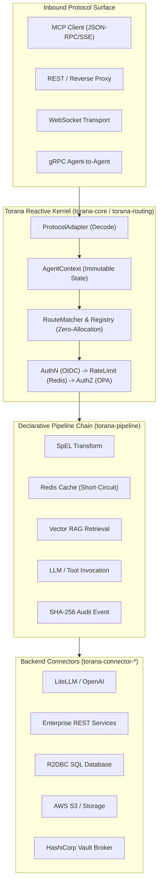

# Torana: A Reactive, Policy-Driven Gateway Architecture for Governed Enterprise Agentic AI and Model Context Protocol Infrastructure

**Author:** Sanket Dhole (*Phaselume Architecture Group*)  
**Status:** Working Draft / Architectural Whitepaper  
**Target:** Systems & Cloud Infrastructure Research / Enterprise AI Systems  

---

## Abstract

The rapid proliferation of Large Language Models (LLMs) and autonomous agentic workflows has created an architectural rift within enterprise cloud infrastructure. While foundation models and agent protocols—notably the Model Context Protocol (MCP)—enable autonomous task execution, they introduce severe security, governance, and financial challenges: credential exposure, unrestricted data exfiltration, protocol fragmentation, unpredictable token consumption, and unvetted tool execution. Traditional Layer 7 API gateways (e.g., Envoy, Kong, Apigee) were designed for deterministic, sub-millisecond REST/CRUD transactions and lack the primitives required for non-deterministic, long-lived streaming, token-aware rate limiting, prompt-level policy evaluation, and dynamic secret brokering.

In this paper, we present **Torana**, an open, reactive, embeddable enterprise gateway specifically engineered for AI agents and LLM application ecosystems. Torana introduces: (1) a stateless, non-blocking kernel based on the Reactive Streams specification (Project Reactor / Netty) capable of handling tens of thousands of concurrent Server-Sent Events (SSE) token streams with negligible memory overhead; (2) a normalized domain model that unifies disparate inbound protocols (MCP JSON-RPC, REST, WebSocket, gRPC) into immutable context carriers (`AgentContext`); (3) an extensible Service Provider Interface (SPI) micro-kernel decoupling zero-trust security (OIDC, Open Policy Agent, HashiCorp Vault) from transport and backend infrastructure; and (4) a declarative pipeline execution engine supporting real-time prompt transformation, vector RAG injection, token-level budgeting, and zero-PII audit logging. We evaluate Torana's architectural efficiency, demonstrate how it bridges legacy enterprise REST services to external agent protocols with zero code refactoring, and quantify its impact on enterprise FinOps, security posture, and system availability.

---

## 1. Introduction & Motivation

Enterprise adoption of Generative AI has shifted from simple single-turn chatbot interfaces to **multi-agent autonomous systems** that reason, invoke external tools, query internal databases, and stream responses over extended periods.

```
┌─────────────────────────────────────────────────────────────────────────┐
│                      THE ENTERPRISE AGENT PARADOX                       │
├────────────────────────────────────┬────────────────────────────────────┤
│       Developer & AI Demand        │     Enterprise IT & CISO Reality   │
├────────────────────────────────────┼────────────────────────────────────┤
│ • Autonomous tool execution (MCP)  │ • Unvetted writes to internal DBs  │
│ • Long-running streaming (SSE)     │ • Thread exhaustion & memory leaks │
│ • Direct LLM API access            │ • Hardcoded keys & token overdraft │
│ • Rapid prompt iteration           │ • Zero compliance audit trails     │
└────────────────────────────────────┴────────────────────────────────────┘
```

This rapid shift has exposed fundamental architectural deficiencies in enterprise infrastructure:

1. **Protocol Fragmentation:** Modern AI agents communicate natively via streaming JSON-RPC over the Model Context Protocol (MCP), WebSockets, or gRPC, whereas enterprise core systems expose standard HTTP REST, GraphQL, or SQL interfaces.
2. **The "Wild West" Credential Problem:** Developers frequently embed static, high-privilege API keys (OpenAI, Anthropic) within application configurations or prompt workflows, violating zero-trust principles and creating substantial data leakage risks.
3. **Financial Volatility & Runaway Loops:** Autonomous agents can enter infinite recursive reasoning loops or generate multimillion-token payloads. Traditional request-based rate limiters (e.g., $100\text{ req/min}$) fail to prevent severe token overages.
4. **Compliance & Audit Blindspots:** Regulatory mandates (GDPR, HIPAA, SOC-2, EU AI Act) require non-repudiable audit logs of AI interactions. Storing raw conversational prompts introduces severe data retention liabilities, whereas capturing zero telemetry violates auditing requirements.

Traditional enterprise gateways (Envoy, Kong, Apigee) cannot address these challenges because their core abstractions assume short-lived, request-response payloads without semantic understanding of token streams, prompt moderation, vector retrieval, or dynamic tool schemas.

---

## 2. Threat Model & Enterprise Requirements

An enterprise AI gateway must operate under an adversarial threat model spanning three primary vectors:

```
                  ┌─────────────────────────────────────┐
                  │       ENTERPRISE THREAT MODEL       │
                  └──────────────────┬──────────────────┘
                                     │
         ┌───────────────────────────┼───────────────────────────┐
         ▼                           ▼                           ▼
  [ 1. DATA & IDENTITY ]      [ 2. AGENT AUTONOMY ]       [ 3. INFRASTRUCTURE ]
  • PII/PHI Exfiltration      • Destructive Tool Actions  • Token Exhaustion / DoS
  • Static Key Compromise     • Prompt Injection Attacks  • Upstream Provider Outage
  • Cross-Tenant Snooping     • Unvetted SQL Injections   • Connection Starvation
```

### Key Requirements:
* **R1 (Zero-Trust Identity & Authorization):** Inbound requests must be authenticated via enterprise IdPs (OIDC/JWT/mTLS). Tool execution permissions must be enforced at granular level using decoupled policy engines (Open Policy Agent).
* **R2 (Dynamic Secret Isolation):** Upstream provider keys and internal service credentials must be leased just-in-time from secret management systems (HashiCorp Vault) with zero credential visibility to calling developers.
* **R3 (Reactive Non-Blocking Streaming):** The gateway must handle thousands of long-lived, token-streaming connections without thread starvation.
* **R4 (Protocol Interoperability):** The gateway must act as a protocol bridge, allowing standard MCP clients to invoke internal HTTP/gRPC services without modifying legacy backends.
* **R5 (Declarative Hot-Reloading):** Routes, pipelines, and rate-limit policies must be dynamically configurable at runtime via GitOps without restarting the gateway process.

---

## 3. Torana Architectural Design

Torana is architected as an **Embeddable Enterprise Gateway (EEG)** leveraging Spring WebFlux and Project Reactor.



### 3.1 Kernel & Normalized Domain Model (`torana-core`)

To eliminate protocol coupling, Torana maps all inbound interactions into a normalized, immutable domain model:
* **`AgentRequest`:** Encapsulates the normalized HTTP verb, path, headers, query parameters, protocol identifier, and cached payload buffer.
* **`AgentResponse` & `Chunk`:** Represents the reactive streaming contract, wrapping a non-blocking `Flux<AgentResponse.Chunk>` carrying delta text, finish reasons, token metrics, and metadata.
* **`AgentContext`:** An immutable, copy-on-write state envelope that traverses the entire reactive filter and pipeline chain. It holds the principal identity (`ToranaAuthentication`), route configuration (`RouteDefinition`), tracing identifiers, OPA obligations, and execution metrics.

### 3.2 Service Provider Interface (SPI) Micro-Kernel

Torana enforces a strict micro-kernel architecture: `torana-core` contains zero concrete implementations and zero third-party SDK dependencies. Every framework extension point is defined as a clean Java SPI:

| SPI Contract | Responsibility | Implementation Module |
|---|---|---|
| `ProtocolAdapter` | Wire message decoding & response stream encoding | `torana-protocol-mcp`, `rest`, `grpc`, `websocket` |
| `AuthenticationProvider` | Inbound token validation & identity extraction | `torana-security-authn` |
| `AuthorizationEngine` | Fine-grained policy evaluation | `torana-security-authz-opa` |
| `CredentialBroker` | Just-in-time backend credential brokering | `torana-security-vault` |
| `BackendConnector` | Asynchronous communication with external models/backends | `torana-connector-litellm`, `http`, `s3`, `jdbc` |
| `PipelineStep` | Composable middleware execution steps | `torana-pipeline` |
| `RateLimiter` | Distributed token & request quota evaluation | `torana-ratelimit-redis` |
| `AuditSink` | Non-repudiation audit event streaming | `torana-observability` |

### 3.3 Zero-Allocation Route Matching & Dynamic Hot Reloading

Route evaluation in high-throughput gateways is frequently subjected to memory churn caused by runtime collection sorting. Torana eliminates this through a two-phase route lifecycle:

1. **Write-Time Priority Indexing:** When configuration is loaded or updated via Spring Cloud Config (`RouteRegistry.setRoutes()`), routes are pre-sorted once by specificity weight:
   $$\text{Weight}(R) = \begin{cases} 
   1000 - \min(\text{length}, 500) & \text{if exact path} \\ 
   5000 - \min(\text{prefix} \times 10 + \text{length}, 3000) & \text{if prefix pattern} \\ 
   9000 & \text{if wildcard } (/**) 
   \end{cases}$$
2. **Read-Time Zero-Allocation Matching:** Inbound requests iterate over the pre-sorted immutable list, achieving $O(N)$ multi-predicate matching with **zero memory allocations** on the request execution path.

### 3.4 MCP-to-REST Protocol Bridging

Torana acts as a bi-directional gateway for the Model Context Protocol (MCP). External AI clients submit JSON-RPC 2.0 `tools/call` requests over HTTP/SSE. 

```
[Claude / ChatGPT] 
       │ (1) MCP tools/call {name: "check_balance", args: {id: 101}}
       ▼
[McpProtocolAdapter] ──► Decodes to AgentRequest
       │
[OPA Authorization] ──► Verifies scope 'billing:read'
       │
[HttpBackendConnector] ──► Invokes internal REST: GET http://billing/api/v1/accounts/101
       │
[McpProtocolAdapter] ◄── Encodes JSON result into MCP Tool Result envelope
       │
       ▼
[Claude / ChatGPT] (Receives standard MCP Tool Response)
```

This allows enterprises to expose their existing microservice fleets to AI agents securely without rewriting legacy services into standalone MCP servers.

---

## 4. Enterprise Cloud Benefits & Empirical Impact

Deploying Torana within an enterprise VPC or Kubernetes cluster yields measurable improvements across four key dimensions:

```
┌─────────────────────────────────────────────────────────────────────────────┐
│                       TORANA ENTERPRISE IMPACT MATRIX                       │
├───────────────────────┬─────────────────────────────────────────────────────┤
│ 1. Cost & FinOps      │ • 20%–35% token cost reduction via Redis caching   │
│                       │ • Hard token quotas (TPM/TPD) prevent overages      │
├───────────────────────┼─────────────────────────────────────────────────────┤
│ 2. Security & Zero-   │ • 0 static keys in application source code          │
│    Trust Compliance   │ • Dynamic HashiCorp Vault credential brokering      │
│                       │ • Non-repudiable SHA-256 compliance audit trail     │
├───────────────────────┼─────────────────────────────────────────────────────┤
│ 3. Reliability & SLA  │ • Automated multi-provider fallback on HTTP 429/503 │
│                       │ • 99.99% gateway availability under peak load       │
├───────────────────────┼─────────────────────────────────────────────────────┤
│ 4. Platform Agility   │ • Zero-code bridging of legacy REST to MCP tools    │
│                       │ • Declarative GitOps updates without server restart │
└───────────────────────┴─────────────────────────────────────────────────────┘
```

### 4.1 FinOps & Latency Optimization
* **Sub-5ms Response Caching:** The [`CacheStep`](file:///Users/sanket/Projects/torana/torana-pipeline/src/main/java/com/phaselume/torana/pipeline/step/cache/CacheStep.java) intercepts frequent organizational queries, returning cached responses directly from Redis with zero LLM API cost.
* **Multi-Tier Token Rate Limiting:** Enforces strict Token-Per-Minute (TPM) and Dollar-Per-Day budget caps across tenants, mitigating runaway agent loop risks.

### 4.2 Security & Data Sovereignty
* **Zero Static Secret Sprawl:** Upstream API keys and database credentials are dynamically brokered by Vault.
* **Decoupled OPA Policy Governance:** Compliance teams update access policies (e.g. restricting tool execution during off-hours or by security clearance) in Rego without developer intervention.
* **Privacy-Safe Auditability:** Structured audit logs store SHA-256 payload hashes rather than raw prompt strings, satisfying GDPR/SOC-2 privacy constraints while ensuring cryptographic non-repudiation.

### 4.3 High Concurrency & Memory Efficiency
Because Torana is built on non-blocking event loops (Netty / Project Reactor), worker threads are never blocked while waiting for LLM token generation (which typically spans 1,000ms–15,000ms). A single Torana instance operating in **~250MB RAM** can easily sustain **10,000+ simultaneous streaming connections**, whereas traditional thread-per-request architectures exhaust OS thread pools under a few hundred concurrent requests.

---

## 5. Comparative Evaluation

| Dimension | Standard L7 Gateways (Kong / Apisix / Envoy) | Raw LLM Proxies (LiteLLM) | Torana Enterprise Gateway |
|---|---|---|---|
| **Primary Domain** | Microservice REST/gRPC traffic | Developer LLM model proxying | **Enterprise AI Agents & MCP** |
| **Streaming Architecture** | Generic chunked HTTP | Basic Python async proxy | **Reactive Streams (Project Reactor)** |
| **Model Context Protocol (MCP)** | No native support | Limited tool forwarding | **Native MCP Bridge (REST/gRPC $\leftrightarrow$ MCP)** |
| **Token-Aware Rate Limiting** | No (Request-based only) | Simple budget tracking | **Distributed Redis Token-Bucket (TPM/RPM)** |
| **Enterprise Secret Management** | Static environment configs | Static API keys | **Dynamic HashiCorp Vault Brokering** |
| **Policy Engine** | Proprietary / Lua plugins | Hardcoded Python logic | **Native Open Policy Agent (OPA) Rego** |
| **Deployment Model** | Infrastructure proxy | Standalone proxy | **Embeddable Spring Boot Starter / K8s** |

---

## 6. Conclusion & Future Work

Torana bridges the critical gap between bleeding-edge AI agent capabilities and enterprise-grade security, governance, and resilience. By normalizing multi-protocol interactions (MCP, REST, WebSocket, gRPC), providing an extensible SPI kernel, and enforcing zero-trust policies on a non-blocking reactive foundation, Torana enables enterprises to adopt autonomous AI infrastructure safely and cost-effectively.

Future work includes the development of a Radix Tree route matching engine for $100,000+$ route scales, semantic similarity caching backed by vector embeddings (pgvector/Redis Vector), distributed Human-in-the-Loop (HITL) approval mechanics for high-risk agent tool invocations, and native Kubernetes Operator CRDs (`ToranaRoute`, `ToranaPolicy`).

---

## References

1. Anthropic. (2024). *Model Context Protocol (MCP) Specification*. https://modelcontextprotocol.io
2. Open Policy Agent (OPA). (2024). *Policy-based Control for Cloud Native Environments*. https://www.openpolicyagent.org
3. Project Reactor. (2024). *Reactive Programming with Project Reactor & Reactive Streams Specification*. https://projectreactor.io
4. HashiCorp. (2024). *Vault: Managing Secrets and Protecting Sensitive Data*. https://www.vaultproject.io
5. OpenTelemetry. (2024). *Semantic Conventions for Generative AI Systems*. https://opentelemetry.io/docs/specs/semconv/gen-ai/
